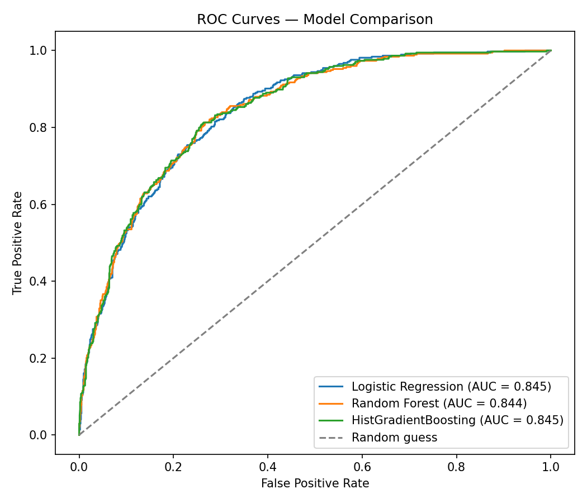

# Customer Churn Prediction

Predicting which telecom customers are likely to cancel their service — and explaining *why* — so a business can act on it before they leave.

## 🎯 Problem

Customer churn is expensive: acquiring a new customer typically costs far more than retaining an existing one. This project builds a model that flags at-risk customers **before** they cancel, and explains the top drivers behind each prediction so a retention team knows exactly what to act on.

**Dataset:** [IBM Telco Customer Churn](https://www.kaggle.com/datasets/blastchar/telco-customer-churn) — 7,043 customers, 21 features (demographics, account info, services subscribed, billing).

## 📊 Results

| Model | Accuracy | Precision | Recall | F1 | ROC-AUC |
|---|---|---|---|---|---|
| Logistic Regression | 0.740 | 0.506 | 0.802 | 0.620 | 0.845 |
| Random Forest | 0.760 | 0.533 | 0.781 | 0.633 | 0.844 |
| **HistGradientBoosting (best)** | **0.757** | **0.528** | **0.810** | **0.639** | **0.846** |

*(Reproduce with `python src/data_prep.py && python src/train.py`)*



## 💡 Key Insight

Contract type dominates churn risk: **month-to-month customers churn at 42.7%**, versus **11.3% for one-year** and just **2.8% for two-year contracts**. Fiber optic internet customers also churn far more (41.9%) than DSL (19.0%) or no-internet customers (7.4%) — likely a mix of higher price points and more competition in that segment.

These two factors compound: customers on month-to-month contracts **and** under 6 months of tenure churn at **56.1%**, more than 2.8x the rate of everyone else (19.7%). That's the highest-leverage segment for a retention campaign — a relatively small group (~19% of the customer base) responsible for a disproportionate share of cancellations. Permutation importance confirms contract type and tenure as the model's top two predictive features.

## 🛠️ Tech Stack

Python · pandas · scikit-learn (Logistic Regression, Random Forest, HistGradientBoosting) · SHAP · matplotlib/seaborn · Streamlit (for the live demo)

## 📁 Project Structure

```
customer-churn-prediction/
├── README.md
├── requirements.txt
├── .gitignore
├── data/
│   ├── raw/              # original Telco-Customer-Churn.csv
│   └── processed/        # cleaned + feature-engineered data
├── notebooks/
│   ├── 01_eda.ipynb
│   ├── 02_feature_engineering.ipynb
│   ├── 03_modeling.ipynb
│   └── 04_explainability.ipynb
├── src/
│   ├── data_prep.py      # cleaning + feature engineering pipeline
│   ├── train.py          # trains & compares 3 models, saves the best
│   ├── evaluate.py       # metrics table + ROC curve plotting
│   └── predict.py        # inference on new customer records
├── models/                # saved model artifacts (.pkl) — gitignored
├── reports/
│   └── figures/           # charts generated during EDA/modeling
└── app/                    # Streamlit dashboard (optional)
```

## 🚀 Setup & Usage

```bash
# 1. Clone and enter the repo
git clone https://github.com/<your-username>/customer-churn-prediction.git
cd customer-churn-prediction

# 2. Install dependencies
pip install -r requirements.txt

# 3. Add the dataset
# Download Telco-Customer-Churn.csv from Kaggle and place it in data/raw/

# 4. Run the pipeline
python src/data_prep.py   # cleans data, engineers features
python src/train.py       # trains Logistic Regression, RF, HistGradientBoosting — saves best + ROC plot

# 5. Try a prediction
python src/predict.py
```

## 📈 Approach

1. **EDA** — class balance, churn rate by contract/tenure/internet service, correlations
2. **Feature engineering** — average monthly spend, tenure buckets, add-on service count
3. **Modeling** — Logistic Regression baseline → Random Forest → HistGradientBoosting, all tuned with `RandomizedSearchCV`
4. **Evaluation** — precision/recall/F1/ROC-AUC (not just accuracy, since churn is imbalanced)
5. **Explainability** — SHAP values to show *why* each customer is flagged as high-risk

## 🔭 Possible Extensions

- Deploy the Streamlit app (`app/`) to Streamlit Community Cloud for a live demo link
- Add prediction intervals / calibrated probabilities instead of raw point predictions
- Wrap the model in a small FastAPI service for programmatic scoring

## 📄 License

MIT
